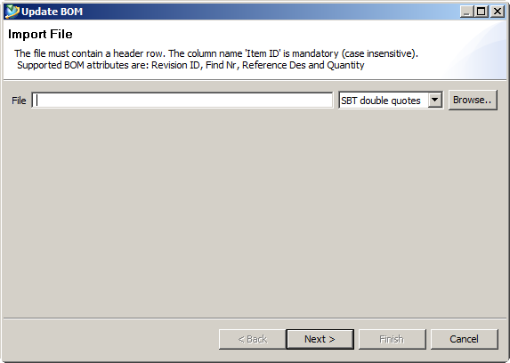
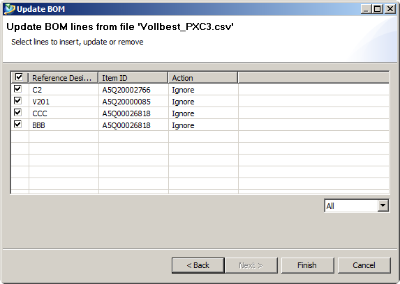

# Import Wizard
 This plugin has some pre defined assets in order to create a semi automatic data import in eclipse.

The wizard features 3 ready-to-use interactive pages (see screen caps at the bottom):

- `SelectFilePage` - select a file and choose a parsing settings
- `SelectFileColumnsPage` - select what column are enabled for the import
- `ImportPage` - review the data before finishing the import

They all extends the `AbstractWizardPage` which gives some extra funtionallity to the default `WizardPage`, such as:  

- `onEnter()` which is called when the user enters the page
- `onLeave()` which is called when the user leaves the page
- `canLeave()` which can be used to prevent next page to render
- `enableNextButton()` which is used redraw the next button

## Usage and implementation
To create a new wizard one has to implement the `IImportProvider`. There is an `AbstractImportprovider` ready to use which includes everything except the import logic.
One also has to define an object to import which has to implement `IRow` in order to work with the `AbstractImportprovider`.

### Import Object
This class is a bean which will store the valued from the import file. Each value that will be imported needs a corresponding field in the object. The id field is additional and is meant for internal use of the importProvider.
We add name to the object.

	public class MyObject extends AbstractRow{
		
		private String id;
		private String name;
		
		@Override
		public String getId() {
			return id;
		}

		@Override
		public boolean equalId(Object obj) {
			if(obj == null || !(obj instanceof IRow))
				return false;
			
			FileRow row = (FileRow) obj;
				
			if(this.getId().equals(row.getId()))
				return true;
			
			return false;
			
		}

		public String getName() {
			return name;
		}

		public void setName(String name) {
			this.name = name;
		}

	}

### Import Provider
The import provider has three important steps `read()`, `run()` and `done()`. 

#### Read
`read()` is implemented in the `AbstractImportprovider` and will read the provided file "as is". This method can be overridden for further functionality. 
I.e. server calls etc. `read()` can also be overwritten to read data from a web service or another source.

#### Run
`run()` is derrived and specified by the `RunnableWithProgressMonitor`. This is to allow a progress bar during the import of data. The `run()` function will iterate over the collection of `IRow`.  

The importProvider also has an optional `IRowService`. The `IRowService` is functionality which will be executed for each row, see below chapter.

#### Done
`done()` is executed when the iteration is complete. This function can display a success message, do some saving logic and refresh the screen content if nessesary.
	
	public class MyImportProvider extends AbstractImportProvider{
	
		public MyImportProvider(Class<? extends IRow> rowClazz) {
			super(rowClazz);
		}
		
		@Override
		public void read() throws IOException,{
			super.read();
		}
	
		@Override
		public void run(IProgressMonitor monitor) throws InvocationTargetException,
				InterruptedException {
			// TODO Auto-generated method stub
		}
	
		@Override
		public void done() {
			// TODO Auto-generated method stub
		}
	
	}

### Row service
The `IRowService` will contain the logic for the import. This is to tell the `IImportProvider` what to do with the data (for each row iteration). 
The `IRowService` has three methods. Each of the method is called during the `IImportProvider` life cycle.

`setRowStatus(IRow row)` is called for each row at `IImportprovider.read()`  
`execute(IRow row)` is called for each row at `IImportprovider.run()`  
`save()` is called once at `IImportprovider.done()`  

	public class MyRowService implements IRowService{
	
		@Override
		public void setRowStatus(IRow row) {
			// TODO Auto-generated method stub
			
		}
	
		@Override
		public void execute(IRow row) throws Exception {
			// TODO Auto-generated method stub
			
		}
	
		@Override
		public void save() throws Exception {
			// TODO Auto-generated method stub
			
		}
	
	}

### CsvPreferences
Is a `HashSet` implementation as a singleton. This asset contains the the different file parsing preferences. By default this collection contains the default `CsvPreference`s given by the SuperCSV package.
If you want to add additional preferences, it is done like this:

	// add specific file parsing settings to the preferences
	CsvPreferences.getInstance().put("SBT single quotes", new CsvPreference.Builder('\'', ';', "\r\n").skipComments(new CommentStartsWith("#")).build());
	CsvPreferences.getInstance().put("SBT double quotes", new CsvPreference.Builder('"', ';', "\r\n").skipComments(new CommentStartsWith("#")).build());

### File Column
`Column` is an implementation of the `IColumn` and contains the information of available columns from the datasource, or in this case, the file. The file columns has to be added to the `IImportProvider`.

The column contains a mapping array `String[] mapping`, this needs to contain at least one entry. The `IColumn` also implements `IEnabled` and `IMandatory` which makes it possible to toggle these flags. All properties has to be set upon instantioation.
The label is a string which will be the display label in the GUI. The propertyName is the field name hard coded in the `IRow` implementation. 

To add the column to the `IImportProvider` the following code can be used:

	importProvider.addColumn(new Column("Item ID", "itemId", new String[]{"item id"}, false, true));

### ImportWizard
Implements the `AbtsractWizard`. This wizard takes the `IImportProvider` and executes the `run()` and `done()` when the finish button is pressed. It also redraws the shell before exit.

### Enabled and Mandatory
`IEnabled` and `IMandatory` a specification which declares if an object can toggle on enabled an mandatory. This is used for the user interaction of choosing what to use and what is mandatory for the import.

### Status
`IStatus` is a specification which declares if an object can have a status. This is used by the `IRowService` to decide what to do with each row.

## Example	
The below code wraps everything together. The code can be found in package `com.accenture.rac.wizards.importer.demo`
	
	public class MyImportWizard extends AbstractHandler {
	
		@Override
		public Object execute(ExecutionEvent event) throws ExecutionException {
			
			// get the environment
			IWorkbenchWindow window = HandlerUtil.getActiveWorkbenchWindowChecked(event);
			Shell shell = window.getShell();
			
			// create importProvider and rowService
			MyImportProvider importProvider = new MyImportProvider(MyObject.class);
			MyRowService rowService = new MyRowService();
			importProvider.setRowService(rowService);
			
			// add valid columns which are mapped to the import object and the propertyId mus be equal to the fieldname.
			importProvider.addColumn(new Column("Name", "name", new String[]{"name", "Name"}, true, true));
			
			// create the pages
			SelectFilePage filepage = new SelectFilePage(importProvider);
			SelectColumnsPage columnPage = new SelectColumnsPage(importProvider);
			ImportPage importPage = new ImportPage(importProvider);
			
			// create the wizard
			ImportWizzard wizard = new ImportWizzard("My Importer");
			wizard.setImportProvider(importProvider);
			
			// add the pages
			wizard.addPage(filepage);
			wizard.addPage(columnPage);
			wizard.addPage(importPage);
			
			// open the dialog
			WizardDialog dialog = new WizardDialog(shell, wizard);
			dialog.open();
			
			return null;
		}
	
	}
	
	
## Screen caps
### Select File

### Select Columns

### Import File

